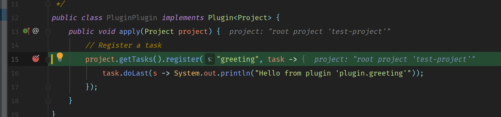
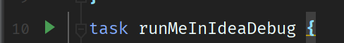
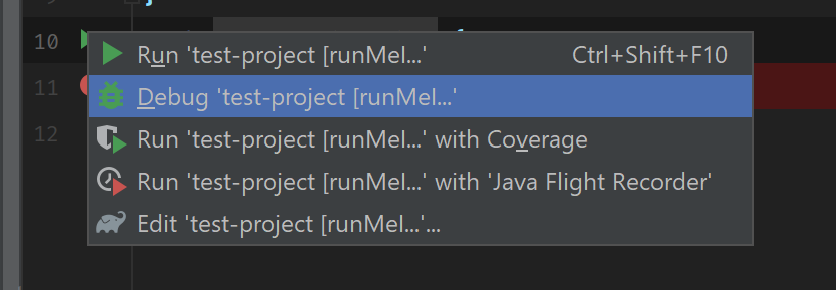
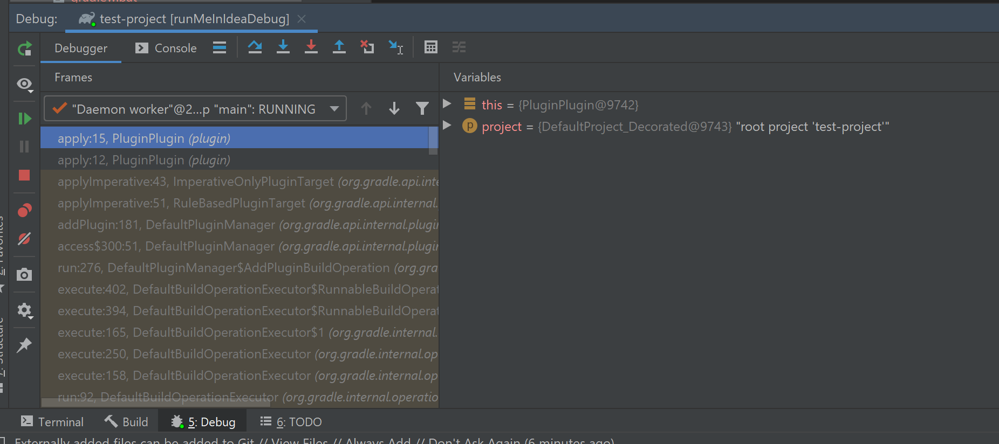

# gradle-lugin-debug-example
## How to run
1. Open `test-project` in Idea.
2. Open class `plugin.PluginPlugin` in `plugin` project.
3. Set breakpoint on line 15. 
4. Open `buld-gradle` file.
5. Debug task `runMeInIdeaDebug` (click green triangle and select debug).  
6. Profit...  

## Build info
* `plugin` project
```shell script
../gradle-6.0.1/bin/gradle init --type java-gradle-plugin --dsl groovy --project-name plugin --package plugin
```
No additional chages.
* `test-project` project
```shell script
../gradle-6.0.1/bin/gradle init --type basic --dsl groovy --project-name test-project
```
Added include build in `settings.gradle` and debug task in `build.gradle`.
* Windows 10 Pro
* Java 
```shell script
$ java -version
openjdk version "11.0.5-BellSoft" 2019-10-15
OpenJDK Runtime Environment (build 11.0.5-BellSoft+11)
OpenJDK 64-Bit Server VM (build 11.0.5-BellSoft+11, mixed mode)

```
* Gradle 6.0.1
```shell script
------------------------------------------------------------
Gradle 6.0.1
------------------------------------------------------------

Build time:   2019-11-18 20:25:01 UTC
Revision:     fad121066a68c4701acd362daf4287a7c309a0f5

Kotlin:       1.3.50
Groovy:       2.5.8
Ant:          Apache Ant(TM) version 1.10.7 compiled on September 1 2019
JVM:          11.0.5-BellSoft (BellSoft 11.0.5-BellSoft+11)
OS:           Windows 10 10.0 amd64
```
